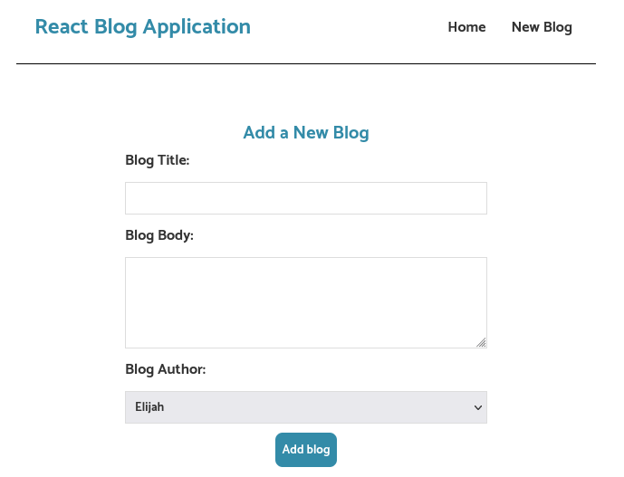
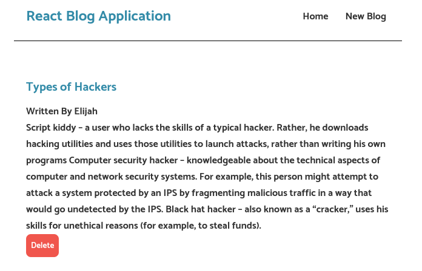

# React Blog Application

<!-- ## This is a simple blog application implemented in React.js -->
## About

This is a simple blog application implemented in React.js

The application consists of few pages a shown below:

## Home Page

Simply lists all the blogs added to the application

## Insert Blog Form

The form simply allows users to add/insert new blogs to the application

## Individual Blogs Page

The Individual Blogs page displays the individual blogs 